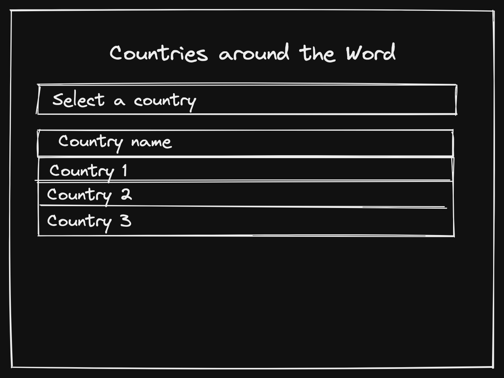

# The Autocomplete Project
## Available Scripts

In the project directory, you can run:

### `npm start`

Runs the app in the development mode.\
Open [http://localhost:3000](http://localhost:3000) to view it in the browser.

The page will reload if you make edits.\
You will also see any lint errors in the console.

### `npm test`

Launches the test runner in the interactive watch mode.\
See the section about [running tests](https://facebook.github.io/create-react-app/docs/running-tests) for more information.

### `npm run build`

Builds the app for production to the `build` folder.\
It correctly bundles React in production mode and optimizes the build for the best performance.

The build is minified and the filenames include the hashes.\
Your app is ready to be deployed!

See the section about [deployment](https://facebook.github.io/create-react-app/docs/deployment) for more information.

---
## Solution Details
### Wireframe:

Implemented endpoints: 
- **https://restcountries.com/v2/all?fields=name**

### Solution:
I created a simple SPA solution using `react`, `typescript`, and `styled-components`. My App displays an `Autocomplete` component and a bonus **native** `Autocomplete`  component. 

- First we fetch data from the implemented endpoint so we can have a country list.
- When the user start to type any word in the `Autocomplete` component input field we filter the Country list with any country name that includes the user input value.
- The user can select one country from the filtered Country name list by **clicking** the name or by tabbing and pressing the **enter key**.